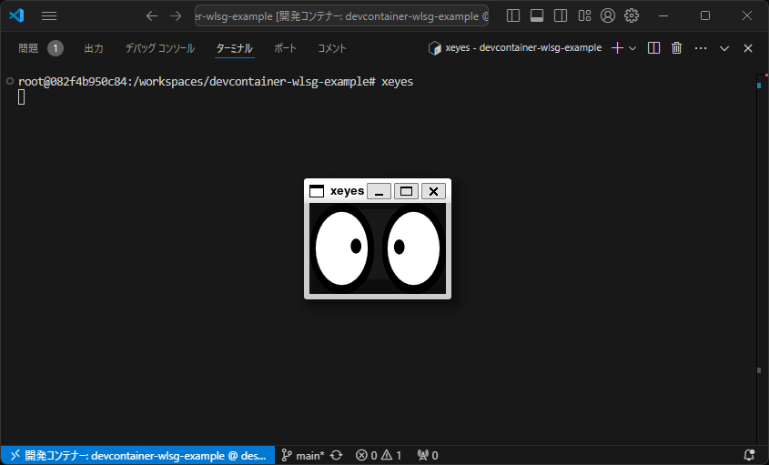
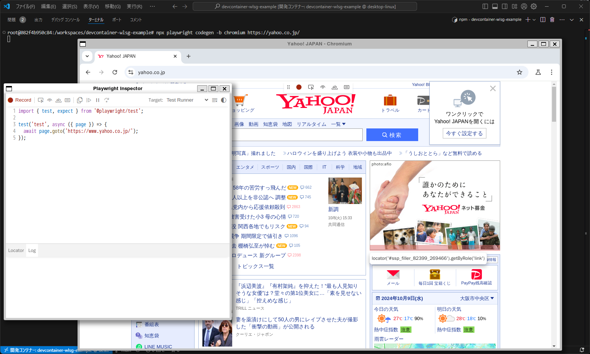

# devcontainer-wlsg-example

Dev ContainersからWSLgを使ってGUIアプリケーションを利用する設定ファイルの例

## 環境

- Windows 11
- Docker Desktop for Windows: 4.34.2
- WSL バージョン: 2.3.24.0
- カーネル バージョン: 5.15.153.1-2
- WSLg バージョン: 1.0.65

## 動作確認

コンテナ内で実行する

### xeyesを動かす

```shell
apt update && apt install -y x11-apps
xeyes
```



### Playwright CodegenでChromiumを動かす

```shell
npx playwright codegen -b chromium https://yahoo.co.jp/
```


